# DGT Studio Pro

A native macOS application for recording, analyzing, and managing over-the-board chess games played on DGT electronic boards.

Connect your DGT eBoard via USB, play your game, and get Stockfish-powered analysis, Glicko-1 rating tracking, and a full game library without ever touching a mouse.

DGT Studio Pro is a ground-up rewrite of [DGT Studio](https://github.com/BeraSenol/DGTStudio), built for production. The original was an ambitious first dive into IOKit serial I/O, SwiftData, binary protocols, and bitwise operations all at once - less a finished product, more a proof of concept that survived contact with the hardware. This version takes everything learned from that experiment and rebuilds it properly: clean architecture, a full test suite, correct data models, and none of the technical debt that accumulates when you're figuring out how a DGT board actually talks to a Mac at the same time as learning Swift.

## At a glance

- **Live recording** - moves played on the physical board are reconstructed into SAN in real time by a hand-built serial stack: IOKit transport, byte framer with resync, message decoder, board diff, and a move reconstructor that only commits a move when it is the single legal explanation of the whole board. Desync recovery guidance, crash-safe drafts, and automatic archiving of finished games.
- **Game library** - SwiftData-backed, with four view modes (icons, list, columns, gallery), live search with token filters, rule-based smart tags, sortable columns, and batch import with content-hash deduplication.
- **Engine analysis** - batch Stockfish analysis with a live queue window and time estimates, per-ply evaluation storage, Syzygy tablebase support, and evaluation graphs with a read-out under the pointer.
- **Players and ratings** - an automatic player registry, Glicko-1 ratings, a configurable ranking ladder (wins, win rate, or rating), and full profiles with rating trends and head-to-head records.
- **Openings and checkmates** - engine-free classification: ECO opening names by longest-prefix match against the bundled lichess table, and special-checkmate detection (smothered, back rank) from the final position.
- **PGN fidelity** - export byte-pinned to DGT's own reference files; a Get Info window where the Seven Tag Roster is edited through native controls and movetext edits are validated by full legal replay before they are accepted.

## Screenshots

### Board

The live mirror of the physical board - coordinates printed for both seats, the stage kept clear, and the sidebar owning all connection and session status.

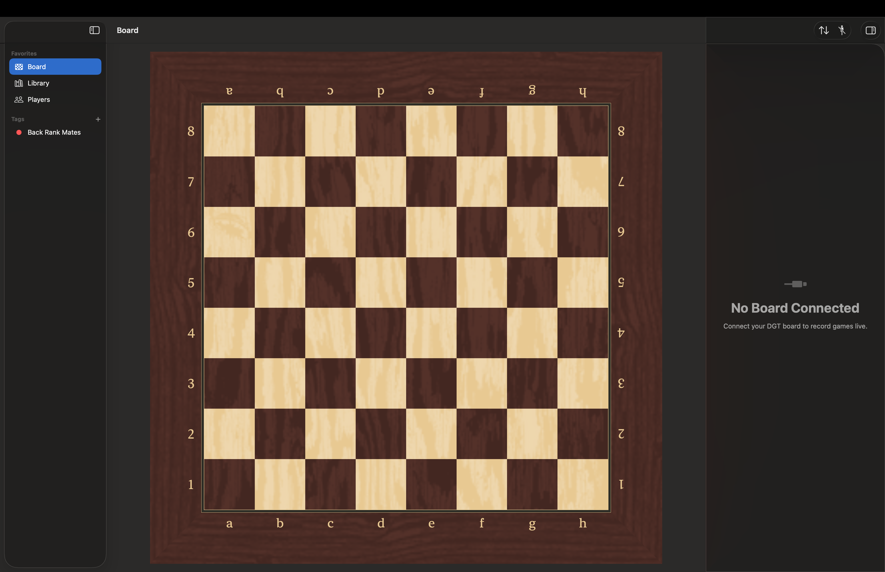

### Library

Every archived game in four view modes - icons, list, columns, and gallery - with live search, smart-tag filtering, and batch engine analysis running behind the toolbar's counter.

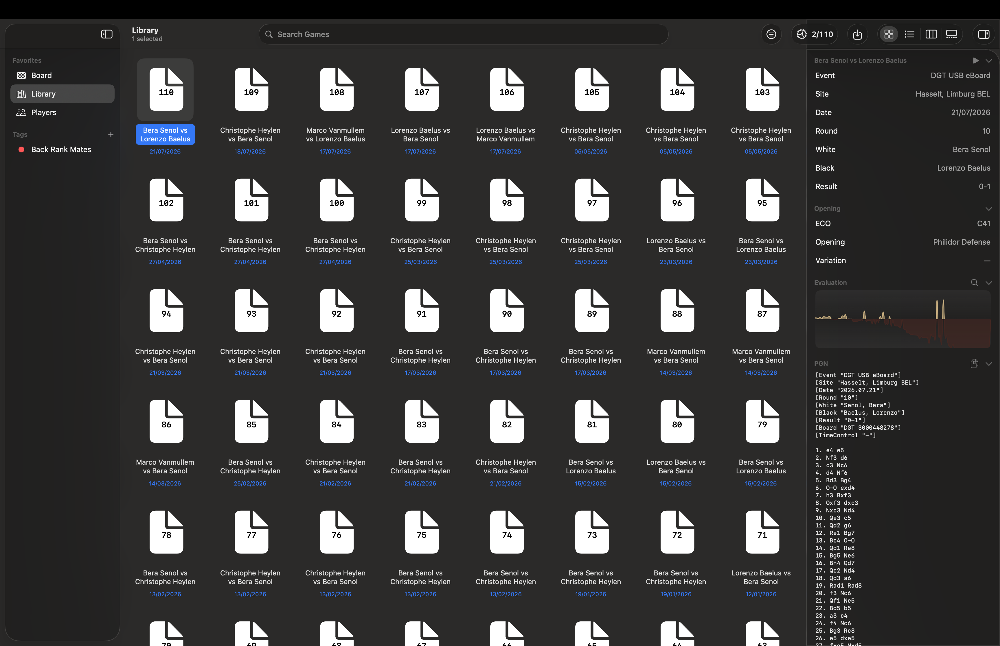

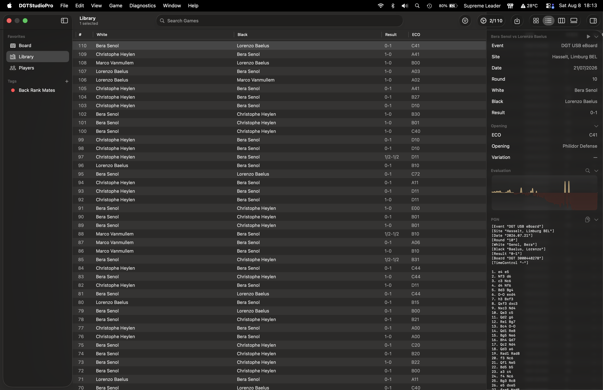

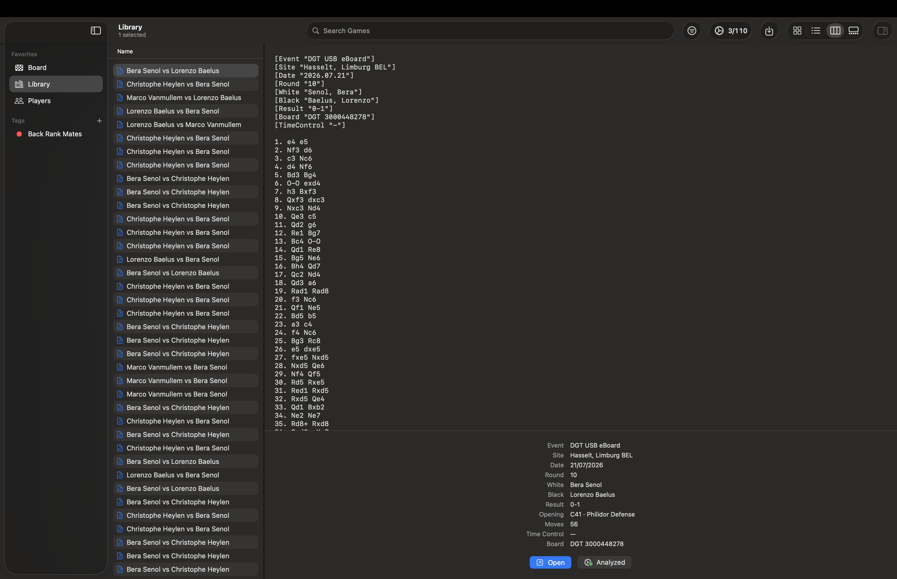

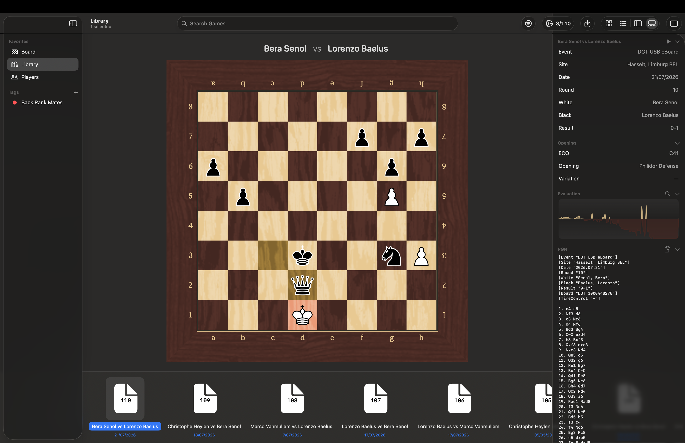

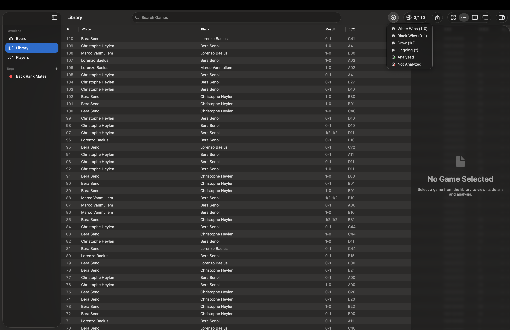

### Analysis

Batch analysis with bundled Stockfish: a queue window showing the live search, per-game progress and the projected time left - and every game's evaluation curve, enlarged in its own window with a read-out under the pointer.

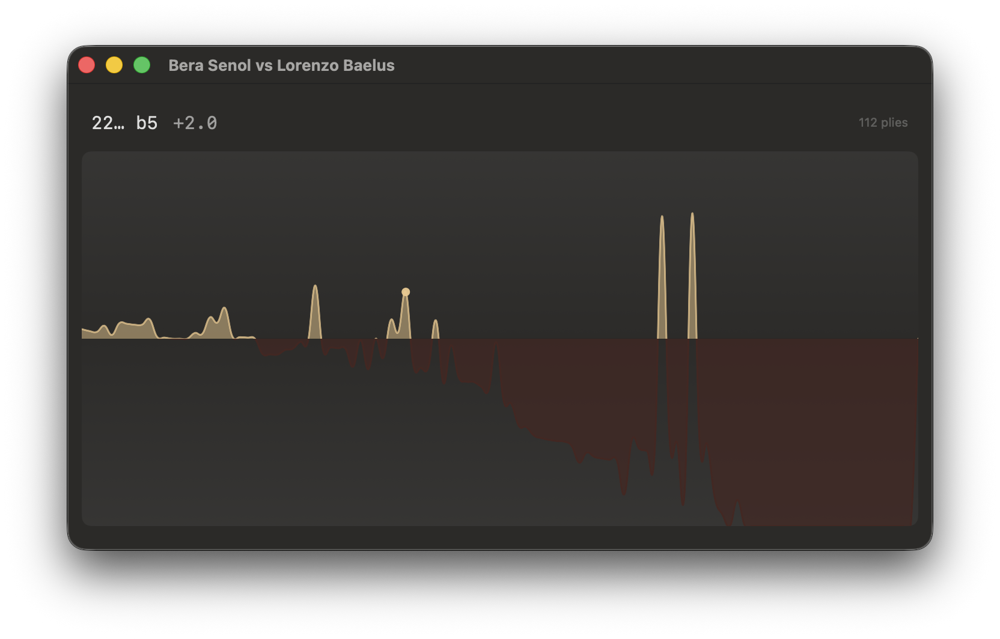

### Get Info

One window over any game, recording or player - the editable Seven Tag Roster on Details, the movetext as a validated score sheet on Move Text, and the file's derived facts on File.

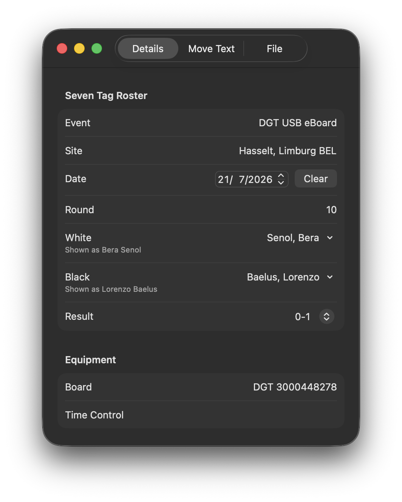

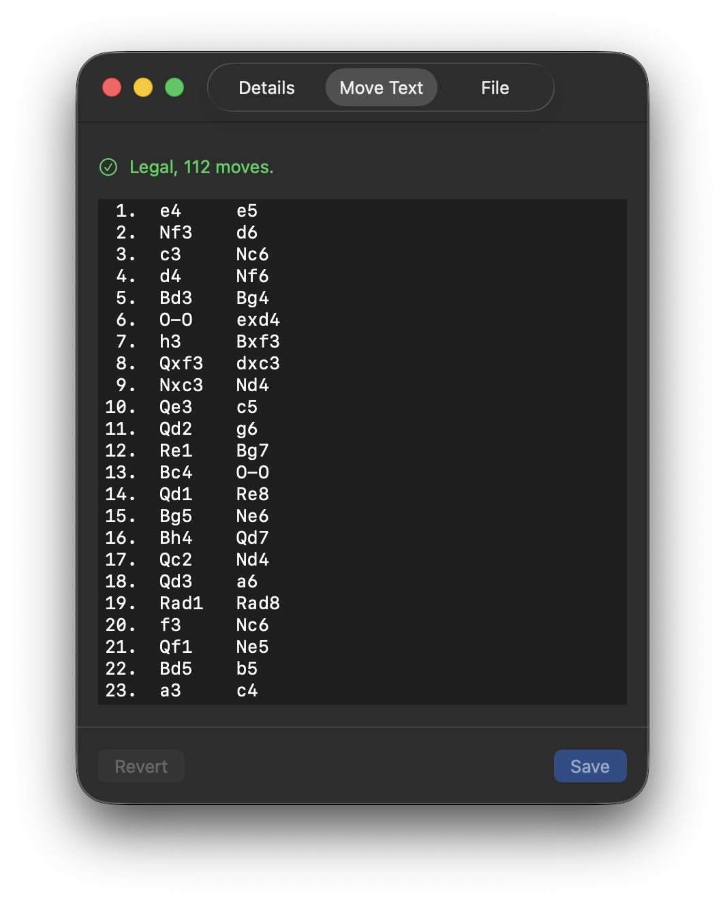

### Players

Every player the Library knows, ranked on a configurable ladder (wins, win rate, or Glicko-1 rating), with a full profile - record, rating trend over games played, and recent encounters - in every view mode.

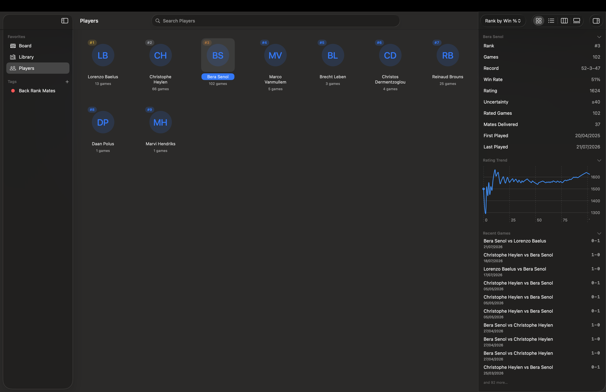

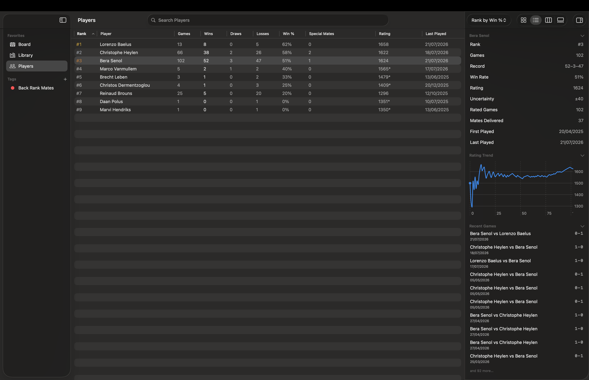

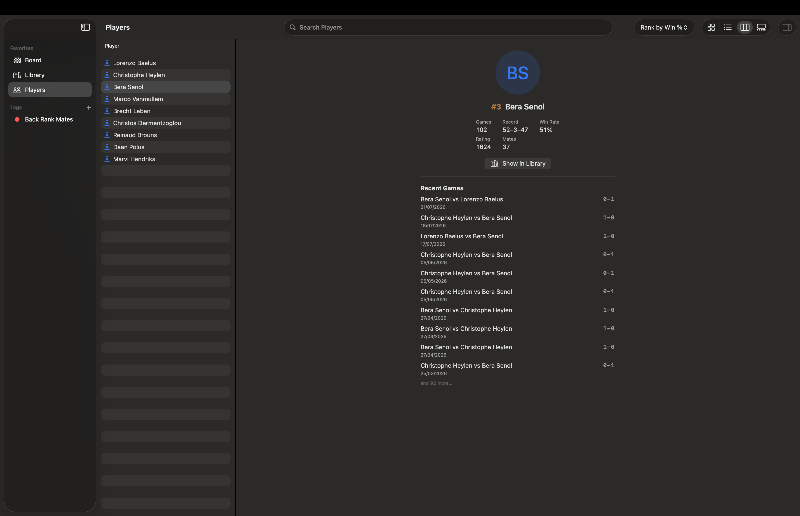

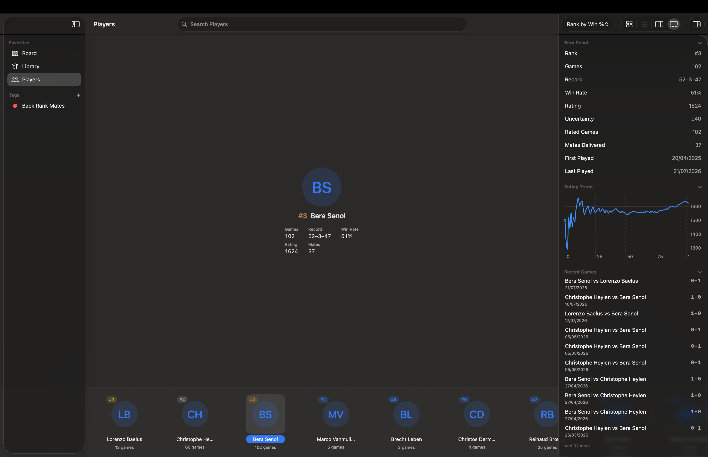

## How it's built

The application is first-party Swift throughout - no third-party packages. The only external components are the Stockfish binary (a separate GPL work, obtained separately and never committed here) and lichess's CC0 opening table, bundled as fetched.

- **A pure chess core.** Board representation, move generation, SAN, and FEN are `Sendable` value types with no I/O, no logging, and no actor - validated by perft suites against reference node counts, including deep positions.
- **Swift 6 language mode** with complete concurrency checking on every target. An actor owns the engine subprocess, the main actor owns the UI and the live session, and the seams between them are explicit.
- **Over 1,100 tests** in more than a hundred Swift Testing suites, runnable headless: the live session's side effects are settable hooks that tests leave nil, so the full plan needs no board, no network, and no engine (engine suites skip when the binary is absent).
- **A written decision log.** Every non-obvious call - seventy-plus of them - is a numbered, argued entry in [docs/internal/DECISIONS.md](docs/internal/DECISIONS.md), append-only, with the rejected alternatives recorded alongside the winner.

The full technical tour - module map, the DGT protocol pipeline, the session state machine, persistence and identity, testing approach - is in [docs/ARCHITECTURE.md](docs/ARCHITECTURE.md).

## Building and running

Requirements: macOS 26.2 or later, Xcode 26.

1. Clone the repository and open `DGTStudioPro.xcodeproj`.
2. *Optional, for engine analysis:* download a Stockfish macOS build from [stockfishchess.org](https://stockfishchess.org) and place the raw binary at `DGTStudioPro/Engine/stockfish` (no file extension, executable bit set). The path is gitignored. Without it the app builds and runs normally; analysis is unavailable and the engine test suites skip.
3. *Optional, for tablebase-exact endgame evaluation:* point Settings at a local Syzygy folder.
4. Build and run. Live recording needs a DGT USB eBoard; the Library, analysis, and player features all work without one.

Tests: ⌘U runs the full plan. No hardware required.

## Documentation

- [docs/ARCHITECTURE.md](docs/ARCHITECTURE.md) - the technical tour.
- [docs/internal/](docs/internal/) - the project's working memory, kept verbatim: the append-only decision log, the standing instructions, and the roadmap.

## License

MIT - see [LICENSE](LICENSE). Stockfish is a separate work under GPL-3.0 and is not distributed with this repository. Opening classification data is from [lichess-org/chess-openings](https://github.com/lichess-org/chess-openings) (CC0). This is a personal project, not affiliated with or endorsed by DGT.
